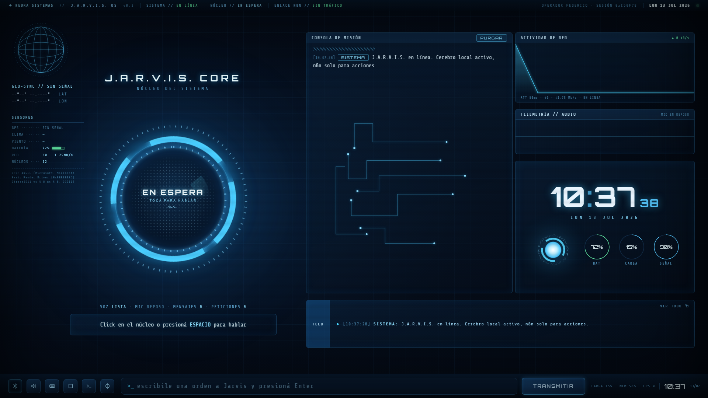
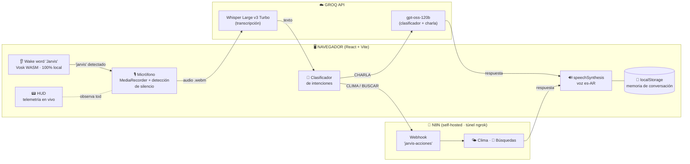
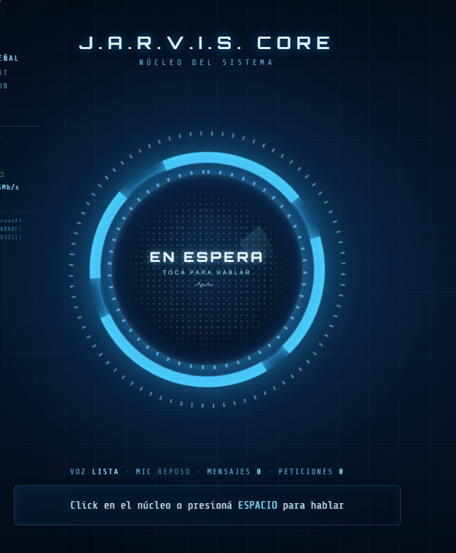
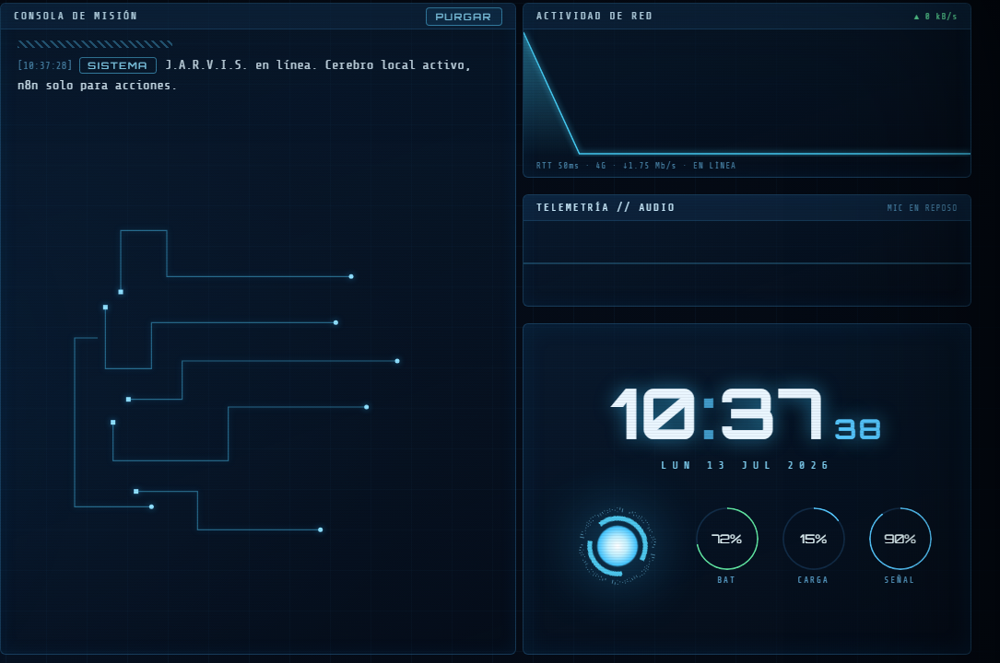

<div align="center">

<br/>

# ⚡ J.A.R.V.I.S. OS

### `NEURA SISTEMAS // ASISTENTE PERSONAL POR VOZ`

**Un HUD estilo Iron Man que escucha, piensa y responde en voz alta.**
Corre en el navegador, con cerebro de IA real y telemetría en vivo.

<br/>


<br/>



<sub>Interfaz real del sistema corriendo en `localhost:5173` — todos los paneles muestran datos en vivo.</sub>

</div>

<br/>

---

## 🧠 ¿QUÉ ES?

**J.A.R.V.I.S.** es un asistente personal por voz con interfaz HUD inspirada en Iron Man. Le hablás (o le escribís), él entiende qué le estás pidiendo, decide solo si lo resuelve con su cerebro de IA o si dispara una automatización externa, y te contesta **hablando en español rioplatense** con personalidad propia: humor seco de programador.

No es una demo con datos falsos: **cada panel del HUD muestra telemetría real** del sistema — red, batería, GPS, clima, micrófono, FPS, memoria — y el núcleo central reacciona en tiempo real a cada estado: `EN ESPERA → ESCUCHANDO → PROCESANDO → RESPONDIENDO`.

<br/>

## ⚙️ ¿QUÉ HACE?

| Capacidad | Cómo funciona |
|---|---|
| 🎙️ **Te escucha** | Graba el micrófono con `MediaRecorder` y corta solo cuando detecta 2,2 s de silencio (análisis de volumen con Web Audio API) |
| ✍️ **Te transcribe** | Manda el audio a **Whisper Large v3 Turbo** en Groq — transcripción en español casi instantánea |
| 🧭 **Clasifica la intención** | Un clasificador LLM decide en milisegundos: ¿es `CHARLA`, `CLIMA` o `BUSCAR`? |
| 💬 **Conversa** | La charla va directo del navegador a **Groq (`gpt-oss-120b`)** — cero operaciones de Make gastadas |
| 🌐 **Ejecuta acciones** | Clima y búsquedas en internet se derivan al workflow **"jarvis-acciones"** en **n8n** (self-hosted, expuesto con ngrok) vía webhook |
| 🔊 **Te responde hablando** | Síntesis de voz del sistema (`speechSynthesis`) con voz masculina en español, blindada contra los bugs de Chrome |
| 🧠 **Tiene memoria** | Guarda hasta 40 mensajes en `localStorage` y manda los últimos 12 como contexto — se acuerda de la conversación entre sesiones |
| 👂 **Wake word "Jarvis"** | Reconocimiento **100 % local** con Vosk (WebAssembly): decís *"Jarvis"* y se despierta solo. El audio nunca sale de tu máquina |

<br/>

## 🔌 ARQUITECTURA — ¿CÓMO ESTÁ CONECTADO?



### El pipeline, paso a paso

1. **Activación** — click en el núcleo, barra `ESPACIO`, o decir *"Jarvis"* con el modo wake word activo.
2. **Grabación inteligente** — el navegador graba y mide el volumen en tiempo real: cuando dejás de hablar 2,2 segundos, corta y envía solo.
3. **Transcripción** — el audio viaja a **Whisper (Groq)** y vuelve como texto en español.
4. **Clasificación** — un LLM con `temperature: 0` responde una sola palabra: `CHARLA`, `CLIMA` o `BUSCAR`.
5. **Ruteo inteligente** 💡 — acá está el truco de eficiencia:
   - `CHARLA` → **directo a Groq desde el navegador** (sin pasar por el servidor de acciones)
   - `CLIMA` / `BUSCAR` → **POST al webhook de n8n** (corriendo local, expuesto a internet con **ngrok**), que resuelve la acción y devuelve texto plano
6. **Respuesta hablada** — el texto se lee en voz alta con la mejor voz masculina en español disponible, y se guarda en la memoria de conversación.

> 💰 **Diseño orientado a costo cero:** n8n corre **self-hosted en tu propia máquina** (sin límites de operaciones ni planes pagos) y todo lo demás (transcripción, clasificación, charla, wake word, voz) corre gratis en Groq o localmente en tu navegador.

<br/>

## 📸 CAPTURAS

<table>
<tr>
<td width="45%" align="center">

<br/><sub><b>⚛️ ARC REACTOR</b> — el núcleo cambia de color y animación según el estado: en espera, escuchando, procesando o hablando</sub>
</td>
<td width="55%" align="center">

<br/><sub><b>📟 CONSOLA + TELEMETRÍA</b> — log de conversación, actividad de red real (kB/s, RTT), waveform del micrófono y reloj con gauges de batería, carga y señal</sub>
</td>
</tr>
</table>

<br/>

## 🚀 CÓMO CORRERLO

### Requisitos

- [Node.js](https://nodejs.org) **18+** (LTS recomendada)
- **Google Chrome** (micrófono + síntesis de voz funcionan mejor ahí)
- Una API key gratuita de [Groq](https://console.groq.com)
- **n8n** corriendo (local o self-hosted) con el workflow **"jarvis-acciones"** activo, expuesto con [ngrok](https://ngrok.com) si el HUD no corre en la misma red

### Instalación

```bash
# 1. Instalar dependencias
npm install

# 2. Configurar credenciales
cp .env.example .env
#    → completar VITE_GROQ_API_KEY y VITE_N8N_WEBHOOK_URL

# 3. Encender el reactor
npm run dev
```

Abrir **http://localhost:5173** en Chrome y permitir el micrófono cuando lo pida.

> ⚠️ **Nunca commitees el `.env`** — ya está en `.gitignore`. Si una key de Groq llega a un repo público, GitHub la detecta y Groq la revoca automáticamente. En Vercel, cargá las variables en *Settings → Environment Variables*.

<br/>

## 🎮 CONTROLES

| Acción | Cómo |
|---|---|
| 🎙️ Hablar | Click en el núcleo o barra **`ESPACIO`** |
| ⌨️ Escribir una orden | Barra inferior + **`Enter`** o botón **TRANSMITIR** |
| 👂 Modo wake word | Botón de retícula en la barra de tareas → decir *"Jarvis"* |
| 🔇 Silenciar la voz | Botón de altavoz en la barra de tareas |
| 🧹 Borrar la memoria | Botón **PURGAR** en la consola de misión |
| 🖥️ Pantalla completa | Botón de pantalla en el dock lateral |
| ✨ Grilla / scanlines | Botones del dock lateral (estética on/off) |

<br/>

## 🗂️ ESTRUCTURA DEL PROYECTO

```
src/
├── config.js                 ← 🔑 webhook de n8n, key de Groq, idioma, operador, personalidad
├── App.jsx                   ← 📟 layout del HUD (escenario 1920×1080 con escala uniforme)
├── styles.css                ← 🎨 estética Iron Man (tokens de color y tipografía)
├── hooks/
│   ├── useJarvis.js          ← 🧠 el cerebro: grabar → Whisper → clasificar → Groq/n8n → hablar
│   ├── useWakeWord.js        ← 👂 vigilancia "Jarvis" con Vosk (WebAssembly, offline)
│   ├── useSystemMetrics.js   ← 📊 batería, red, GPS, clima, FPS, memoria, núcleos
│   └── useAudioAnalyser.js   ← 🎵 waveform en vivo del micrófono
└── components/
    ├── ArcReactor.jsx        ← ⚛️ el núcleo central animado
    ├── HudParts.jsx          ← 🧩 paneles, consola, feed, globo, circuitos, iconos
    └── Graphs.jsx            ← 📈 minigráficos, gauges y onda de audio
```

### Configuración (`src/config.js` + `.env`)

| Variable | Qué es |
|---|---|
| `VITE_N8N_WEBHOOK_URL` | URL del webhook del workflow **"jarvis-acciones"** en n8n (túnel de ngrok si es local) |
| `VITE_GROQ_API_KEY` | Key de Groq — transcripción, clasificador y charla |
| `IDIOMA` | Idioma de voz y transcripción (`es-AR`) |
| `OPERADOR` | Tu nombre en el HUD |
| `PERSONALIDAD` | El system prompt de Jarvis: humor seco de programador, respuestas de 1–3 frases pensadas para voz |

<br/>

## 🛠️ STACK TECNOLÓGICO

| Capa | Tecnología | Costo |
|---|---|---|
| UI / HUD | React 18 + Vite 5, CSS puro (sin frameworks) | Gratis |
| Transcripción | Whisper Large v3 Turbo vía Groq | Gratis |
| Cerebro / clasificador | `openai/gpt-oss-120b` vía Groq | Gratis |
| Acciones (clima, búsqueda) | n8n self-hosted — workflow "jarvis-acciones" + túnel ngrok | Gratis (corre en tu máquina) |
| Wake word | Vosk (modelo español ~40 MB, WebAssembly, offline) | Gratis |
| Voz de salida | `speechSynthesis` del sistema operativo | Gratis |
| Memoria | `localStorage` del navegador | Gratis |

<br/>

## 🗺️ ROADMAP

- [x] ~~Wake word "Jarvis"~~ → **hecho con Vosk, 100 % local**
- [x] ~~Memoria de conversación~~ → **hecho con `localStorage` (40 mensajes)**
- [x] ~~Clasificador de intenciones~~ → **hecho: CHARLA / CLIMA / BUSCAR**
- [x] ~~Migración de Make a n8n~~ → **hecho: self-hosted, sin límite de operaciones**
- [ ] Más ramas de acciones en n8n: tareas, YouTube, agenda, mail
- [ ] Voz premium local (Piper TTS)
- [ ] Gestos con MediaPipe Hands
- [ ] Control de domótica

<br/>

---

<div align="center">

**⚡ NEURA SISTEMAS // J.A.R.V.I.S. OS v0.2 ⚡**

<sub>*"A veces hay que correr antes de poder caminar."* — T. Stark</sub>

</div>
